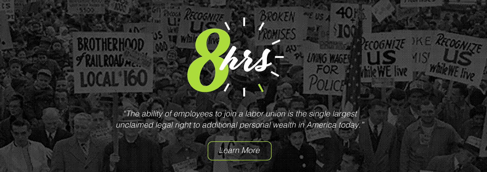

<div align="center">
	<br>
</div>

-----------------
## Summary
**8hrs** is web application designed and developed by Team [Haymarket](https://github.com/8hrs) to help workers communicate and organize.

## Application Concept
Our app will allow individuals at an organization communicate and to start to organize the beginning stages of a labor organization. Participation made digitally will reduce the concerns of individuals feeling they would be who would be spied on, harassed, pressured, threatened, suspended, fired, deported or otherwise victimized if they publically attempted to even show interest in joining a union.
The app can be accessed here: https://8hrs.github.io/8hrs/.

<div align="center">
	<br>
</div>

## Motivation for Development
Americans want more influence in the workplace to win better wages, better benefits, and more flexible work schedules—all of which can be gained through joining a union. The ability of employees to join a labor union is the single largest unclaimed legal right to additional personal wealth in America today.

## Design Process
We wanted to create a simple yet appealing interface that would allow individuals to quickly see information based on current campaigns and to create one if one did not exist.   

## Technologies utilized - TBD!!!

Technology:
HTML
CSS
Javascript
API/JSON
Node express server
MySQL
Sequelize ORM
Handlebars for server-side templating
Heroku
New Library

APIs
* [Glassdoor] (https://www.glassdoor.com/developer/companiesApiActions.htm) - Company information

Libraries:
* [Bootstrap 3.3.7](https://getbootstrap.com/docs/3.3/)


## What's Included
Within the download archive you'll find the following directories and files, logically grouping common assets and utilizes the MVC Framework and Application Structure. You'll see something like this:

```
8hrs/
├── config/
│   │   ├── config.json
│   │   └── connection.js
├── controllers/
│   │   ├── api-controller.js
├── ext_api/
│   │   ├── glassdoor.js
├── models/
│   │   ├── index.js
├── public/
│   │   ├── css
│   │   │   └── styles.css
│   │   ├── images...
│   │   └── js
│   │   │   └── index.js
│   │   │   └── search.js
│   │   └── foundpage.html
│   │   └── index.html
│   │   └── newcampaign.html
├── routes/
│   │   └── ext-api-routes.js
│   │   └── html-routes.js
├── views/
│   │   └── index.handlebars
├── .gitignore
├── app-env
├── package-lock.json
├── package.json
├── README.md
├── schema.sql
├── server.js
```
## Future development
* User Login

## Members of Team [Haymarket](https://github.com/8hrs):
* Dennis Hodges - [fermentationist](https://github.com/fermentationist)
* Jang Yurai - [jangyjang](https://github.com/jangyjang)
* Jessica Toro-Pacheco - [jessicatoro2](https://github.com/jessicatoro2)
* Mhirra Yung - [lookatdmoon](https://github.com/lookatdmoon)


