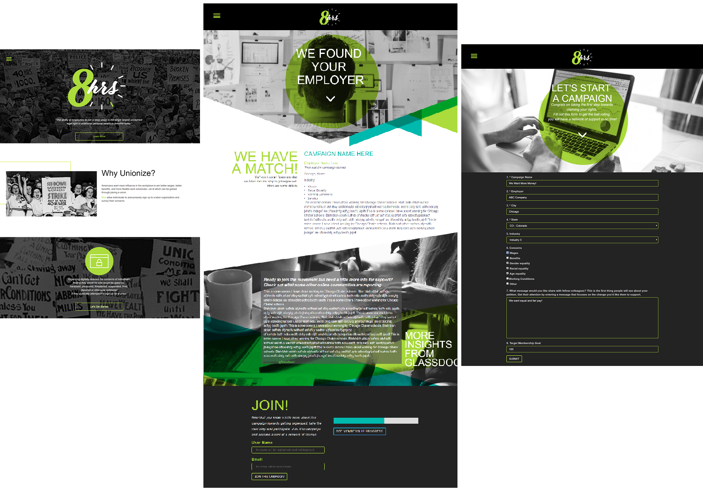
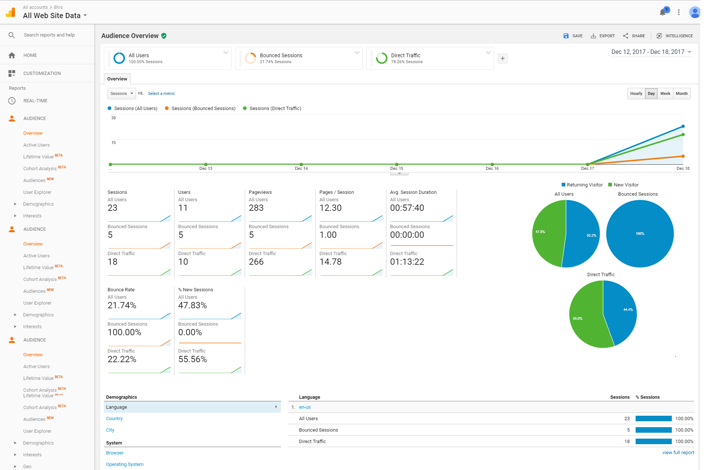

<div align="center">
	<br>
</div>

## Description
**8hrs** is web application designed and developed by [Team Haymarket](https://github.com/8hrs) to help workers communicate and organize.  

## How to access the app
The app can be accessed [here](https://eight-hrs.herokuapp.com/).

Once the app has loaded the employee will:
1. View the site and will learn more about why they should unionize and
click on the button 'Let's Get Started' to perform a search for his Employer.  
<div align="center">
	<br>
</div>
2. If the Employer is found, then the employee can view an existing campaign and join the campaign [foundpage.html](https://eight-hrs.herokuapp.com/foundpage.html)
3. If an employer is not found, then the employee is brought to a page to create a new campaign [newcampaign.html](https://eight-hrs.herokuapp.com/newcampaign.html)
4. At any time - the employee can click on the hamburger icon to go to ['Home'](https://eight-hrs.herokuapp.com/) or the ['Resources'](https://eight-hrs.herokuapp.com/resources.html) page

## Motivation for Development
Americans want more influence in the workplace to win better wages, better benefits, and more flexible work schedules—all of which can be gained through joining a union.

The ability of employees to join a labor union is the single largest unclaimed legal right to additional personal wealth in America today.  Moving this digitally gives them more freedom to join anonymously.

## Application Concept
Our app will allow individuals at an organization communicate and to start to organize the beginning stages of a labor organization. Participation made digitally will reduce the concerns of individuals feeling they would be who would be spied on, harassed, pressured, threatened, suspended, fired, deported or otherwise victimized if they publically attempted to even show interest in joining a union.

<div align="center">
	<br>
</div>

## Design Process
We wanted to create a simple yet appealing interface that would allow individuals to quickly see information based on current campaigns and to create one if one did not exist.   

## Technology

Technologies:
* HTML
* CSS

CSS Library:
* [Bootstrap 3.3.7](https://getbootstrap.com/docs/3.3/) - Bootstrap is an open source toolkit for developing with HTML, CSS, and JS.

Javascript itself, modules and libraries:
* [JavaScript](https://www.w3schools.com/js/) - JavaScript, often abbreviated as JS, is a high-level, dynamic, weakly typed, prototype-based, multi-paradigm, and interpreted programming language.
* [JSON](https://www.json.org/) - JSON (JavaScript Object Notation) is a lightweight data-interchange format.
* [Node.js](https://nodejs.org/en/) - Node.js® is a JavaScript runtime built on Chrome's V8 JavaScript engine. Node.js uses an event-driven, non-blocking I/O model that makes it lightweight and efficient.
* [Node express server](http://expressjs.com) - Fast, unopinionated, minimalist web framework for Node.js
* [Sequelize](http://docs.sequelizejs.com/) - Sequelize is a promise-based ORM for Node.js v4 and up. It supports the dialects PostgreSQL, MySQL, SQLite and MSSQL and features solid transaction support, relations, read replication and more.
* [Handlebars](http://handlebarsjs.com/) - Handlebars provides the power necessary to let you build semantic templates effectively with no frustration. Handlebars is largely compatible with Mustache templates.

APIs:
* [Glassdoor](https://www.glassdoor.com/developer/companiesApiActions.htm) - Company information

Database:
* [MySQL](https://www.mysql.com)- MySQL is the world's most popular open source database

Cloud Application Platform:
* [Heroku](https://www.heroku.com/) - Cloud Application Platform

Analytics:
* [Google Analytics](https://analytics.google.com/analytics/web/#embed/report-home/a111282891w165969998p166452255/) - Google Analytics gives you the digital analytics tools you need to analyze data from all touchpoints in one place, for a deeper understanding of the user experience.  Please see below for screenshots.

<div align="center">
Real-Time Overview
	<br>
</div>
<div align="center">
Real-Time Traffic Sources
	<br>
</div>
<div align="center">
Audience Overview
	<br>
</div>
<div align="center">
Users Flow
	<br>
</div>
## What's Included
Within the download archive you'll find the following directories and files, logically grouping common assets and utilizes the MVC Framework and Application Structure. You'll see something like this:

```
8hrs/
├── config/
│   │   ├── config.json
│   │   └── connection.js
├── controllers/
│   │   ├── campaign-api-routes.js
│   │   ├── employer-api-routes.js
│   │   ├── user-api-routes.js
├── ext_api/
│   │   ├── glassdoor.js
├── models/
│   │   ├── campaign.js
│   │   ├── employer.js
│   │   ├── index.js
│   │   ├── user.js
├── public/
│   │   ├── css
│   │   │   └── styles.css
│   │   ├── images...
│   │   └── js
│   │   │   └── index.js
│   │   │   └── search.js
│   │   │   └── statesArray.js
│   │   └── foundpage.html
│   │   └── index.html
│   │   └── newcampaign.html
│   │   └── resources.html
├── routes/
│   │   └── ext-api-routes.js
│   │   └── html-routes.js
├── views/
│   │   └── layouts
│   │   │   └── main.handlebars
│   │   │   └── test.handlebars
│   │   └── found.handlebars
│   │   └── index.handlebars
├── .gitignore
├── package-lock.json
├── package.json
├── README.md
├── server.js
```
## Future development
* Add user account and logins
* Introduction of an Admin/Campaign Organizer
* Management of campaigns
* User forum/message boards

## Members of [Team Haymarket](https://github.com/8hrs):


* Dennis Hodges - [fermentationist](https://github.com/fermentationist)
* Jang Yurai - [jangyjang](https://github.com/jangyjang)
* Jessica Toro-Pacheco - [jessicatoro2](https://github.com/jessicatoro2)
* Mhirra Yung - [lookatdmoon](https://github.com/lookatdmoon)

Thanks for visiting!!
